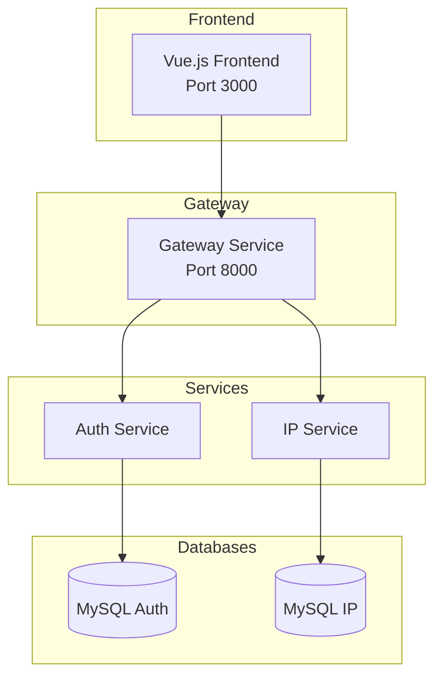

# IPAM Microservices

A microservices-based IP Address Management System built with Laravel and Vue.js.

## Architecture



| Service | Port | Description |
|---------|------|-------------|
| Frontend | 3000 | Vue.js 3.5 SPA with TypeScript |
| Gateway | 8000 | API routing, circuit breaker, rate limiting |
| Auth Service | internal | JWT authentication, RBAC, user management |
| IP Service | internal | IP address CRUD, tamper-proof audit logs |

## Tech Stack

- **Backend:** Laravel 12 / PHP 8.2
- **Frontend:** Vue.js 3.5 + TypeScript + Pinia + Vue Router
- **Database:** MySQL 8.0
- **Auth:** Laravel Passport (OAuth2/JWT)
- **Containerization:** Docker + Docker Compose
- **Testing:** PHPUnit (backend) + Vitest (frontend)

## Prerequisites

Before you begin, ensure you have the following installed:

| Requirement | Version | Notes |
|-------------|---------|-------|
| **Docker** | 20.10+ | [Install Docker](https://docs.docker.com/get-docker/) |
| **Docker Compose** | v2+ | Included with Docker Desktop |
| **Git** | 2.0+ | For cloning the repository |

### Windows Users
- Install [Docker Desktop for Windows](https://docs.docker.com/desktop/install/windows-install/)
- Enable WSL 2 backend (recommended) or Hyper-V
- Ensure Docker Desktop is running before executing commands

### Linux Users
- Install Docker Engine and Docker Compose plugin
- Add your user to the docker group: `sudo usermod -aG docker $USER`

### macOS Users
- Install [Docker Desktop for Mac](https://docs.docker.com/desktop/install/mac-install/)

## Quick Start

### Option 1: Using Make (Linux/macOS)

```bash
git clone https://github.com/acg8326/ipam-microservices.git
cd ipam-microservices
cp .env.example .env
make fresh
```

### Option 2: Using Docker Compose Directly (Windows/Linux/macOS)

```bash
git clone https://github.com/acg8326/ipam-microservices.git
cd ipam-microservices
cp .env.example .env

# Build and start containers
docker compose up -d --build

# Wait for services to initialize (about 15-20 seconds)
# The entrypoint automatically runs migrations and sets up Passport

# Seed default users
docker compose exec auth-service php artisan db:seed --force
```

> **Windows Users:** Use `copy .env.example .env` instead of `cp`

Access the application:
- **Frontend:** http://localhost:3000
- **API Gateway:** http://localhost:8000

**Default Login Credentials:**
| Role | Email | Password |
|------|-------|----------|
| Admin | admin@example.com | password123 |
| User | user@example.com | password123 |

Verify services are running:
```bash
curl http://localhost:8000/api/health
```

### Common Commands

| Task | Make | Docker Compose |
|------|------|----------------|
| Start services | `make up` | `docker compose up -d` |
| Stop services | `make down` | `docker compose down` |
| View logs | `make logs` | `docker compose logs -f` |
| Run migrations | `make migrate` | `docker compose exec auth-service php artisan migrate --force` |
| Seed database | `make seed` | `docker compose exec auth-service php artisan db:seed --force` |
| Run tests | `make test-be` | `docker compose exec auth-service php artisan test` |

See [Docker Documentation](docs/docker.md) for detailed setup, commands, and troubleshooting.

## Post-Installation

After running `make fresh` (or the Docker Compose commands), the system is ready to use.

### 1. Access the Application

Open your browser and go to: **http://localhost:3000**

### 2. Login

Use one of the default accounts:

| Role | Email | Password | Permissions |
|------|-------|----------|-------------|
| **Admin** | admin@example.com | password123 | Full access - can manage all IPs, users, and view audit logs |
| **User** | user@example.com | password123 | Can add IPs, edit own IPs only, view all IPs |

### 3. Explore Features

**As Admin (admin@example.com):**
- ✅ View dashboard with system statistics
- ✅ Add, edit, delete any IP address
- ✅ Manage users (create, edit roles)
- ✅ View audit logs with tamper-proof verification
- ✅ Filter audit logs by user, session, or IP address

**As Regular User (user@example.com):**
- ✅ View dashboard
- ✅ View all IP addresses
- ✅ Add new IP addresses
- ✅ Edit only IP addresses you created
- ❌ Cannot delete IP addresses
- ❌ Cannot access audit logs or user management

### 4. Verify Health (Optional)

```bash
curl http://localhost:8000/api/health
```

Expected response:
```json
{
  "gateway": "healthy",
  "services": {
    "auth": {"status": "healthy"},
    "ip": {"status": "healthy"}
  }
}
```

## Features

- **Authentication:** JWT-based login with automatic token refresh
- **Role-Based Access:** Admin and User roles with different permissions
- **IP Management:** Create, read, update, delete IP addresses (IPv4/IPv6)
- **Audit Logging:** Tamper-proof logs with SHA256 hash chain
- **Dashboard:** Overview statistics and recent activity
- **User Management:** Admin can create/manage users

## API Usage

All requests go through the Gateway at `http://localhost:8000`.

### Authentication

```bash
# Register (admin only via Settings page)
# Login
curl -X POST http://localhost:8000/api/auth/login \
  -H "Content-Type: application/json" \
  -d '{"email":"admin@example.com","password":"password123"}'
```

### Protected Requests

```bash
# Use the token from login response
curl http://localhost:8000/api/ip-addresses \
  -H "Authorization: Bearer {your_access_token}"
```

## Testing

```bash
# Run all tests
make test

# Frontend only
make test-fe

# Backend only  
make test-be
```

See [Testing Guide](docs/testing.md) for detailed documentation.

## Documentation

| Document | Description |
|----------|-------------|
| [Features Overview](docs/features.md) | Complete feature list, security model, endpoints |
| [Security Guide](docs/security.md) | Authentication, authorization, rate limiting, CORS, audit logs |
| [Frontend Guide](docs/frontend.md) | Vue.js SPA architecture, components, state management |
| [Testing Guide](docs/testing.md) | PHPUnit and Vitest setup, running tests, writing tests |
| [Docker Setup](docs/docker.md) | Container configuration, commands, troubleshooting |
| [Gateway Service](docs/gateway.md) | Routing, circuit breaker, rate limiting |
| [Auth Service API](docs/auth-service.md) | Authentication endpoints, error responses |
| [IP Service API](docs/ip-service.md) | IP management endpoints, audit logs |

## License

MIT

---

*Last updated: February 3, 2026*