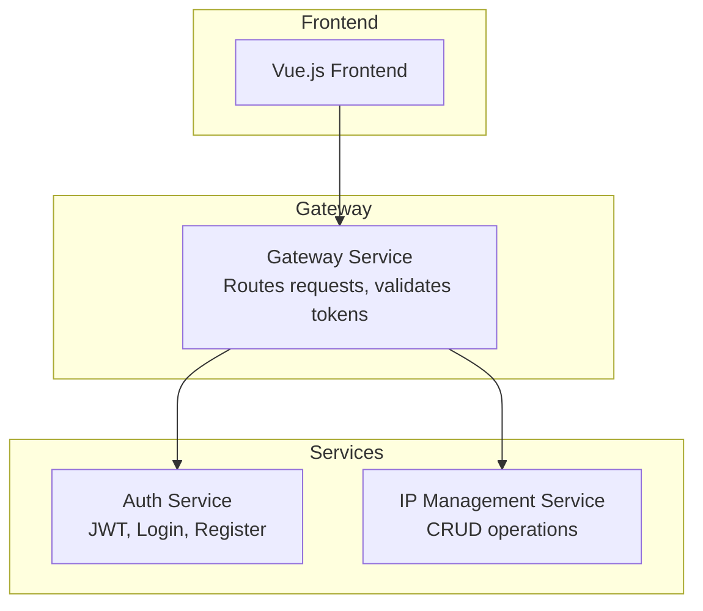

# IPAM Microservices

A microservices-based IP Address Management System built with Laravel and Vue.js.

## Architecture


- **Vue.js Frontend** - Single Page Application
- **Gateway Service** - API Gateway/Router
- **Auth Service** - Authentication & Authorization (JWT + RBAC)
- **IP Management Service** - Core CRUD operations for IP records

## Tech Stack
- **Backend:** Laravel 12
- **Frontend:** Vue.js 3.5
- **PHP:** 8.2
- **Database:** MySQL
- **Containerization:** Docker

## Services

### Gateway Service (Port 8000)
API Gateway that routes all requests to backend services.

**Features:**
- Request proxying with token forwarding
- Circuit breaker (5 failures → 30s recovery)
- Health check endpoint
- Request logging with tracing
- Rate limiting (60 req/min)

**Endpoints:**
| Method | Endpoint | Routes To |
|--------|----------|-----------|
| GET | /api/health | Gateway health + service status |
| * | /api/auth/* | Auth Service |
| * | /api/ip-addresses/* | IP Service |
| * | /api/audit-logs/* | IP Service |

### Auth Service (Port 8001)
Handles authentication and authorization using Laravel Passport.

**Endpoints:**
| Method | Endpoint | Description | Auth |
|--------|----------|-------------|------|
| POST | /api/register | Register new user | No |
| POST | /api/login | Login and get token | No |
| GET | /api/user | Get current user | Yes |
| POST | /api/logout | Logout and revoke token | Yes |
| POST | /api/refresh | Refresh access token | Yes |
| GET | /api/users | List all users (admin only) | Admin |

### IP Service (Port 8002)
Handles IP address management with CRUD operations and tamper-proof audit logging.

**Endpoints:**
| Method | Endpoint | Description | Auth |
|--------|----------|-------------|------|
| GET | /api/ip-addresses | List all IP addresses | Yes |
| POST | /api/ip-addresses | Create new IP address | Yes |
| GET | /api/ip-addresses/{id} | Get specific IP address | Yes |
| PUT | /api/ip-addresses/{id} | Update IP address | Yes |
| DELETE | /api/ip-addresses/{id} | Delete IP address | Admin |
| GET | /api/audit-logs | List audit logs (filter by session_id, user_id) | Admin |
| GET | /api/audit-logs/verify | Verify audit log hash chain integrity | Admin |

### Auth Service Audit Endpoints
| Method | Endpoint | Description | Auth |
|--------|----------|-------------|------|
| GET | /api/auth/audit-logs | List auth audit logs | Admin |
| GET | /api/auth/audit-logs/verify | Verify auth audit log integrity | Admin |

## Quick Start

### Option 1: Docker (Recommended)

```bash
# Clone the repository
git clone https://github.com/acg8326/ipam-microservices.git
cd ipam-microservices

# Copy environment file
cp .env.example .env

# Build and start all services
make up-build

# Or using docker compose directly
docker compose up -d --build

# Run migrations and setup Passport
make fresh
```

Services will be available at:
- **Gateway:** http://localhost:8000
- **Health Check:** http://localhost:8000/api/health

### Option 2: Manual Setup

#### Prerequisites
- PHP 8.2
- Composer
- MySQL
- Node.js & npm

#### Installation

1. Clone the repository
```bash
git clone https://github.com/acg8326/ipam-microservices.git
cd ipam-microservices
```

2. Setup Auth Service
```bash
cd services/auth-service
composer install
cp .env.example .env
php artisan key:generate
php artisan migrate
php artisan passport:install
php artisan serve --port=8001
```

3. Setup IP Service
```bash
cd services/ip-service
composer install
cp .env.example .env
php artisan key:generate
php artisan migrate
php artisan serve --port=8002
```

4. Setup Gateway Service
```bash
cd services/gateway
composer install
cp .env.example .env
php artisan key:generate
php artisan serve --port=8000
```

## API Authentication

All protected endpoints require a Bearer token:
```
Authorization: Bearer {your_access_token}
```

Token responses include `expires_in` (seconds) for automatic renewal:
```json
{
    "access_token": "eyJ0eXAiOiJKV1...",
    "token_type": "Bearer",
    "expires_in": 3600,
    "session_id": "c9dcc60dfaecb93d..."
}
```

> **Session Tracking:** The `session_id` is the JWT's `jti` claim - cryptographically tied to the token and cannot be spoofed. It's used for audit log tracking across services.

### Roles
- **admin** - Full access to all resources
- **user** - Limited access to resources

## Security Features

- **JWT Authentication** - RSA-signed tokens via Laravel Passport
- **Session Tracking** - Each token has unique session ID (JWT `jti`)
- **Tamper-proof Audit Logs** - SHA256 hash chain with integrity verification
- **RBAC** - Role-based access control (admin/user scopes)
- **Circuit Breaker** - Automatic service isolation on failures
- **Rate Limiting** - 60 requests/minute per client

## Documentation

- [Gateway Service](docs/gateway.md)
- [Auth Service API](docs/auth-service.md)
- [IP Service API](docs/ip-service.md)