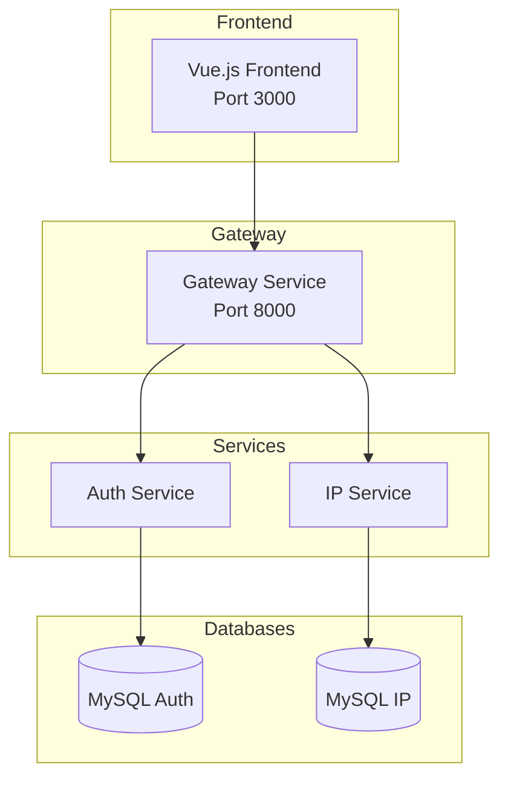

# IPAM Microservices

A microservices-based IP Address Management System built with Laravel and Vue.js.

## Architecture



| Service | Port | Description |
|---------|------|-------------|
| Frontend | 3000 | Vue.js SPA user interface |
| Gateway | 8000 | API routing, circuit breaker, rate limiting |
| Auth Service | internal | JWT authentication, RBAC, user management |
| IP Service | internal | IP address CRUD, tamper-proof audit logs |

## Tech Stack

- **Backend:** Laravel 12 / PHP 8.2
- **Frontend:** Vue.js 3.5 + TypeScript + Pinia
- **Database:** MySQL 8.0
- **Auth:** Laravel Passport (OAuth2/JWT)
- **Containerization:** Docker + Docker Compose

## Quick Start

```bash
# Clone and start
git clone https://github.com/acg8326/ipam-microservices.git
cd ipam-microservices
cp .env.example .env
make up-build
make fresh
```

Access the application:
- **Frontend:** http://localhost:3000
- **API Gateway:** http://localhost:8000

Verify services are running:
```bash
curl http://localhost:8000/api/health
```

See [Docker Documentation](docs/docker.md) for detailed setup, commands, and troubleshooting.

## API Usage

All requests go through the Gateway at `http://localhost:8000`.

### Authentication

```bash
# Register
curl -X POST http://localhost:8000/api/auth/register \
  -H "Content-Type: application/json" \
  -d '{"name":"John","email":"john@example.com","password":"password123","password_confirmation":"password123"}'

# Login
curl -X POST http://localhost:8000/api/auth/login \
  -H "Content-Type: application/json" \
  -d '{"email":"john@example.com","password":"password123"}'
```

### Protected Requests

```bash
# Use the token from login response
curl http://localhost:8000/api/ip-addresses \
  -H "Authorization: Bearer {your_access_token}"
```

## Documentation

| Document | Description |
|----------|-------------|
| [Features Overview](docs/features.md) | Complete feature list, security model, endpoints summary |
| [Docker Setup](docs/docker.md) | Container configuration, commands, troubleshooting |
| [Gateway Service](docs/gateway.md) | Routing, circuit breaker, rate limiting |
| [Auth Service API](docs/auth-service.md) | Authentication endpoints, error responses |
| [IP Service API](docs/ip-service.md) | IP management endpoints, audit logs |

## License

MIT